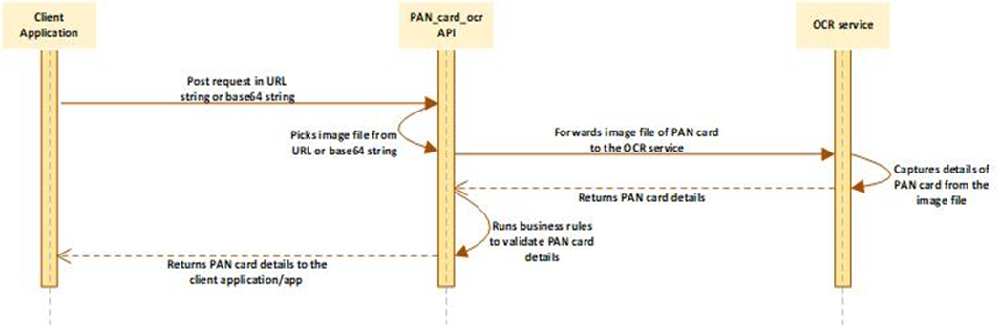

# Pan Card
## API Name
PAN_card_ocr

## Ovreview
The **PAN_card_ocr** API receives the request in the form of URL string or base64 string. It picks the image file of PAN card from the request. It captures the details of the PAN card from the image file. It validates the details of the PAN card and then return these details to the client application.

## How it Works

## Features and Benefits
* A complete automated solution to capture the details of PAN card
* Efficiently captures the text/characters from the cropped, rotated, and disoriented image files
* Secured Socket Layer based data encryption
* Incorporates smart business rules to validate PAN card document
* Captures the image from two string formats: **URL string** and **base64** string
* Light-weight and faster execution leads to real time, frictionless user experience

## Security and Compliance
* Secured Socket Layer based data encryption
* RBI Compliance
* Tax Department Compliant
* Captures the required and necessary details of the PAN card
* Maintains data confidentiality across all mediums and data channels

## Technical Details
### Description
This API receives the request in the form of **URL string** or **base64** string. It picks the image file of PAN card from the request. Therefore, it internally calls a service that in turn captures the details of the PAN card.

On the basis of configured keyword, the **PAN_card_ocr** API validates the PAN card document. After the PAN card document is successfully validated, it returns the details of the PAN card holder.

